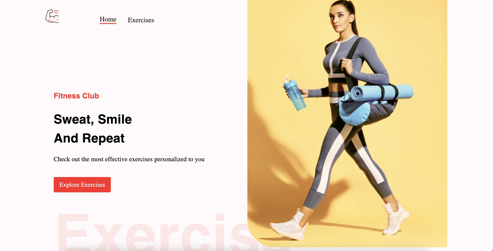
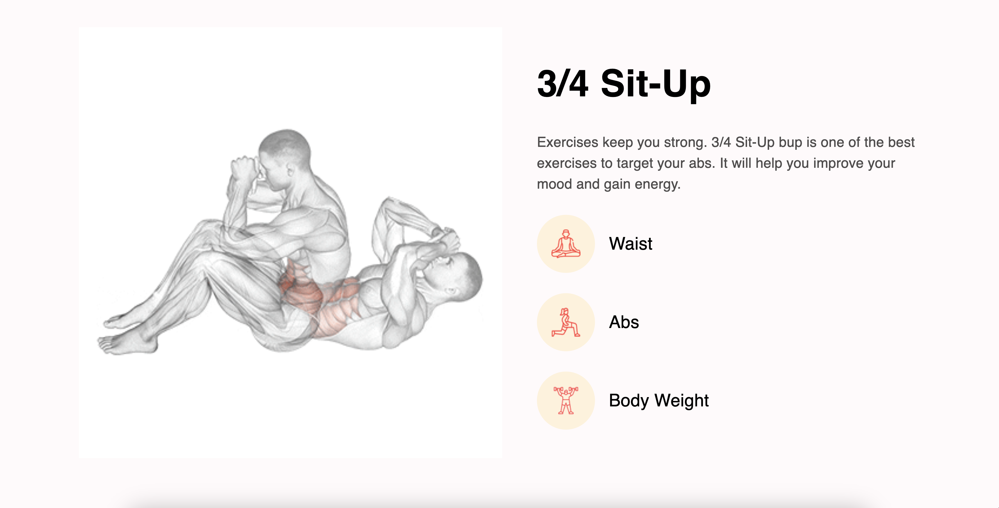

# Gym Exercises - ReactJS

## 📷 Screenshot

  

  

## 📝 Project Description

The gym exercise project allows users to view the list of exercises, search, and view the details of each exercise body part using RapidAPI ExerciseDB.

## 📚 Technologies

- [ReactJS](https://reactjs.org/)
- [MUI](https://mui.com/)
- [React Router](https://reactrouter.com/)
- [Axios](https://github.com/axios/axios)
- [API: RapidAPI](https://rapidapi.com/justin-WFnsXH_t6/api/exercisedb/)
